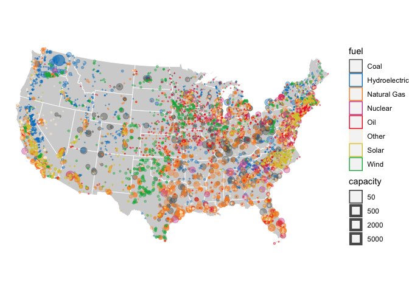

Electricity Generation Map
================
Amy Kouch
2020-02-19

  - [Mapping how the United States generates its
    electricity](#mapping-how-the-united-states-generates-its-electricity)

``` r
# Libraries
library(tidyverse)
library(ussf)
library(sf)
library(readxl)
library(here)
library(mapproj)

# Parameters

file_generators_plants <- 
  here::here("c01-own/data/generators_plants_2016.rds")

states <-
  ussf::boundaries(geography = "state", projection = "albers") %>%
  filter(!NAME %in% c("Alaska", "Hawaii")) 

natural_gas <-
  c(
    "Natural Gas Fired Combined Cycle",
    "Natural Gas Fired Combustion Turbine",
    "Natural Gas Internal Combustion Engine",
    "Natural Gas Steam Turbine",
    "Natural Gas with Compressed Air Storage",
    "Other Natural Gas"
  )

coal <-
  c(
    "Coal Integrated Gasification Combined Cycle", 
    "Conventional Steam Coal")

nuclear <-
  c("Nuclear")

hydroelectric <-
  c(
    "Conventional Hydroelectric",
    "Hydroelectric Pumped Storage"
  )

oil <-
  c(
    "Petroleum Coke",
    "Petroleum Liquids"
  )

wind <-
  c(
    "Offshore Wind Turbine",
    "Onshore Wind Turbine")

solar <-
  c(
    "Solar Photovoltaic"
  )

other <-
  c(
    "All Other", 
    "Batteries",
    "Flywheels",
    "Geothermal",
    "Landfill Gas",
    "Municipal Solid Waste",
    "Other Gases",
    "Other Waste Biomass",
    "Wood/Wood Waste Biomass",
    "Solar Thermal with Energy Storage",
    "Solar Thermal without Energy Storage",
    NA_real_
  )

#===============================================================================
```

# Mapping how the United States generates its electricity

Recreating [The Washington Post’s
Visualizations](https://www.washingtonpost.com/graphics/national/power-plants/?noredirect=on&utm_term=.c26c761b9a3c)

``` r
US_ALBERS <- 
  "+proj=aea +lat_1=29.5 +lat_2=45.5 +lat_0=37.5 +lon_0=-96 +x_0=0 +y_0=0 +datum=WGS84 +no_defs"

gen_plants <-
  file_generators_plants %>%
  read_rds() %>%
  mutate(
    fuel = 
      case_when(
        technology %in% natural_gas ~ "Natural Gas",
        technology %in% coal ~ "Coal",
        technology %in% nuclear ~ "Nuclear",
        technology %in% hydroelectric ~ "Hydroelectric",
        technology %in% oil ~ "Oil",
        technology %in% wind ~ "Wind",
        technology %in% solar ~ "Solar",
        technology %in% other ~ "Other",
      )
  ) %>%
  group_by(plant_code, fuel) %>%
  mutate(
    capacity = sum(capacity)
  ) %>%
  distinct() %>%
  drop_na(long, lat) %>%
  st_as_sf(coords = c("long", "lat"), crs = 4326) %>%
  st_transform(crs = US_ALBERS) 
```

``` r
gen_plants %>%
  ggplot() +
  geom_sf(
    data = states, 
    fill = "lightgray", 
    color = "white", 
    size = 0.3
  ) + 
  geom_sf(
    aes(color = fuel, size = capacity),
    data = gen_plants,
    alpha = 0.4
  ) + 
  scale_color_manual(
    values = 
      c(
        "Natural Gas" = "#f78b29", 
        "Coal" = "#585b56", 
        "Nuclear" = "#cf4a9b", 
        "Hydroelectric" = "#0081c5", 
        "Oil" = "#ee1b24", 
        "Wind" = "#0fb14c", 
        "Solar" = "#d7c944", 
        "Other" = "#ffefd6"
      )
  ) +
  scale_size(
    range = c(0.1, 6), 
    breaks = c(50, 500, 2000, 5000)
  ) + 
  theme_void() + 
  theme(
    legend.position = "right"
  )
```

<!-- -->
