Electricity Generation Map (2018)
================
Amy Kouch
2020-03-08

  - [Mapping how the United States generates its
    electricity](#mapping-how-the-united-states-generates-its-electricity)
  - [Plants by Fuel Type](#plants-by-fuel-type)
  - [Energy Mix in Texas](#energy-mix-in-texas)

### Mapping how the United States generates its electricity

Recreating [The Washington Post’s
Visualizations](https://www.washingtonpost.com/graphics/national/power-plants/?noredirect=on&utm_term=.c26c761b9a3c)
regarding power plant generation in the United States.

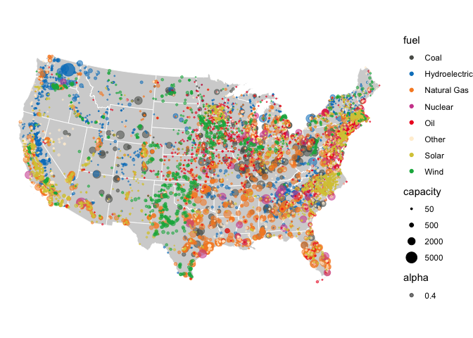<!-- -->

### Plants by Fuel Type

The visualizations below are also recreations of the Washington Post’s
maps of the US.

Regionally: \* Wind plants are along the middle of the United States \*
Solar and hydroelectric power are on the two coasts \* Natural gas
appears to be prevalent everywhere \* Coal, oil, and nuclear are more
common in the East than the West

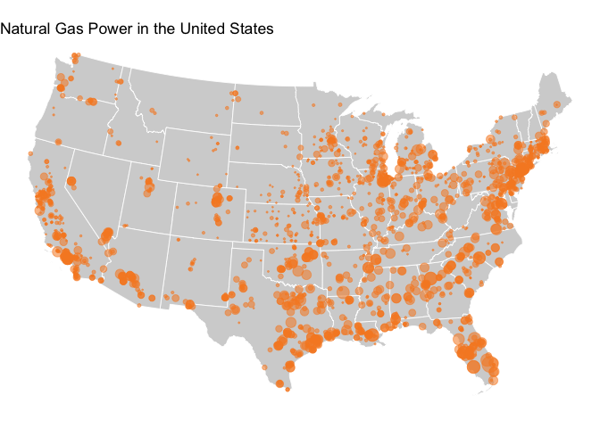<!-- -->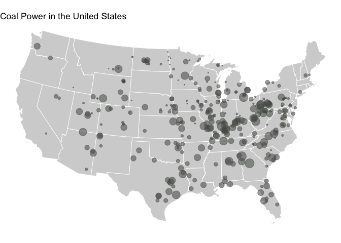<!-- -->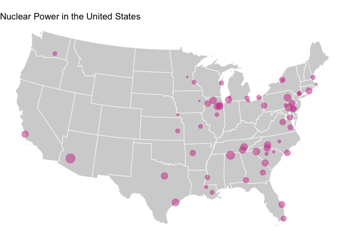<!-- -->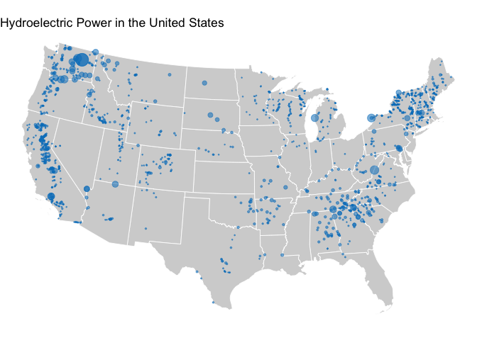<!-- -->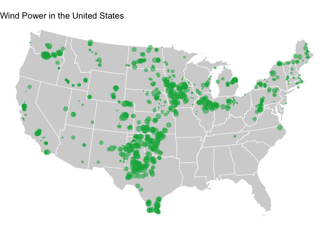<!-- -->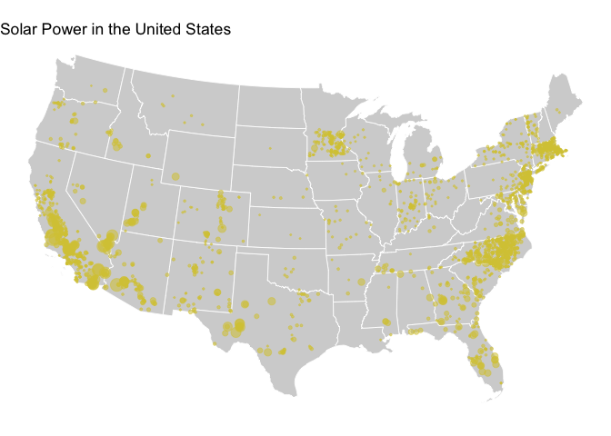<!-- -->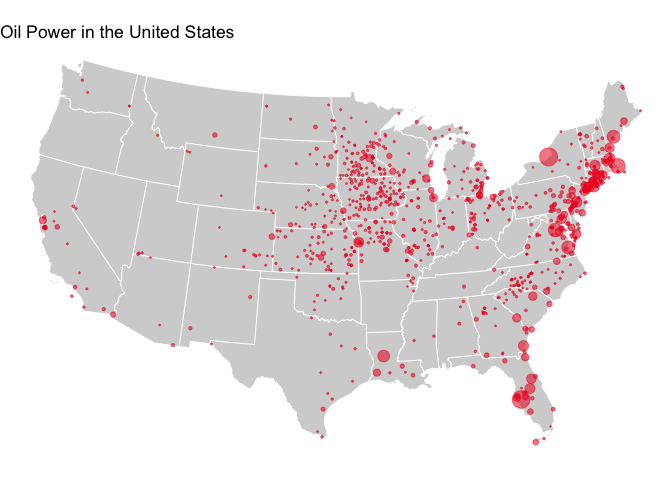<!-- -->

### Energy Mix in Texas

**Understanding Texas’ energy mix**

  - More than 60% of Texas’ capacity is in Natural gas
  - Renewable energy resources are less than 20% of the mix
  - Baseload sources: nuclear, coal
  - Peaker: natural gas

The Solutions Project has determined that the ideal renewable energy mix
includes 50% of [wind](https://thesolutionsproject.org/infographic/#tx)
by 2050.

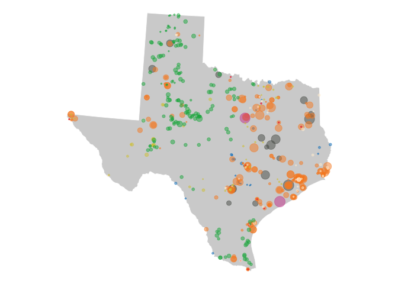<!-- -->

| fuel          | generation | percentage |
| :------------ | ---------: | ---------: |
| Coal          |    20443.5 |      0.140 |
| Hydroelectric |      708.6 |      0.005 |
| Natural Gas   |    92129.6 |      0.630 |
| Nuclear       |     5138.6 |      0.035 |
| Oil           |      117.8 |      0.001 |
| Other         |     1518.8 |      0.010 |
| Solar         |     1943.1 |      0.013 |
| Wind          |    24187.3 |      0.165 |

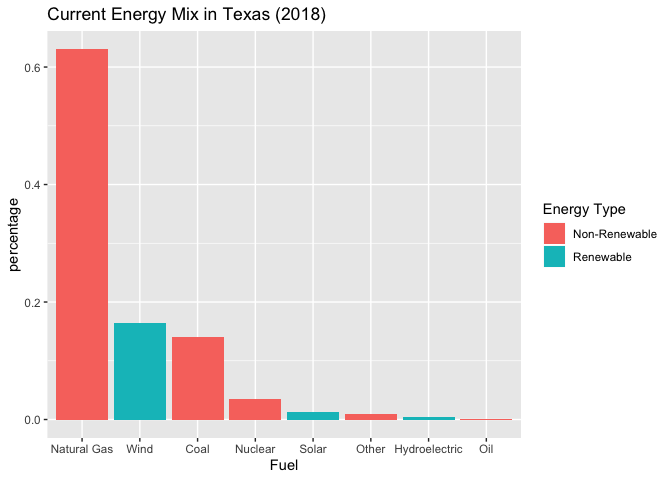<!-- -->

    ## Warning: Column `fuel` joining factor and character vector, coercing into
    ## character vector

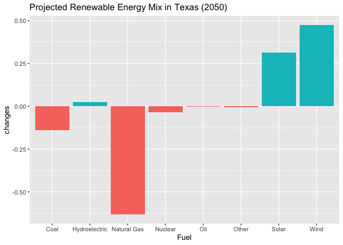<!-- -->

As seen from the visualization above, Texas will have to increase its
already- large wind capacity.

**“Texas produces more electricity than any other state, generating
almost twice as much as Florida, the second-highest
electricity-producing state.” (EIA)**

``` r
gen_plants %>%
  st_drop_geometry() %>%
  group_by(state) %>%
  summarise(energy_produced = sum(capacity)) %>%
  arrange(desc(energy_produced))
```

    ## # A tibble: 49 x 2
    ##    state energy_produced
    ##    <chr>           <dbl>
    ##  1 TX            146187.
    ##  2 CA             92414.
    ##  3 FL             75864 
    ##  4 PA             55508.
    ##  5 NY             53803.
    ##  6 IL             51437.
    ##  7 GA             43728.
    ##  8 NC             41947.
    ##  9 WA             38689.
    ## 10 AZ             36999.
    ## # … with 39 more rows
