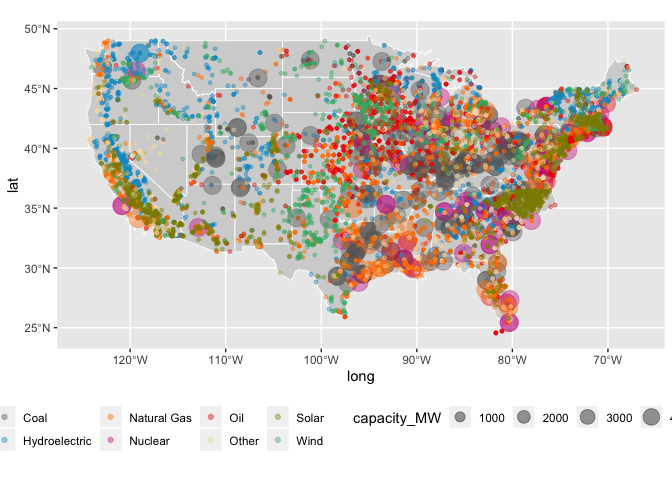
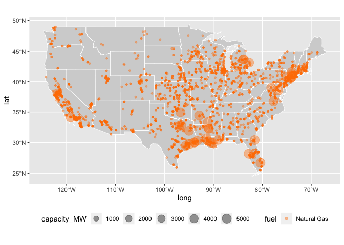
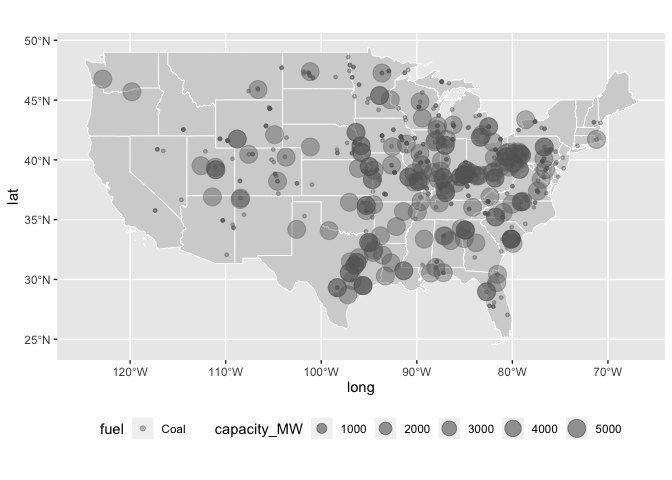
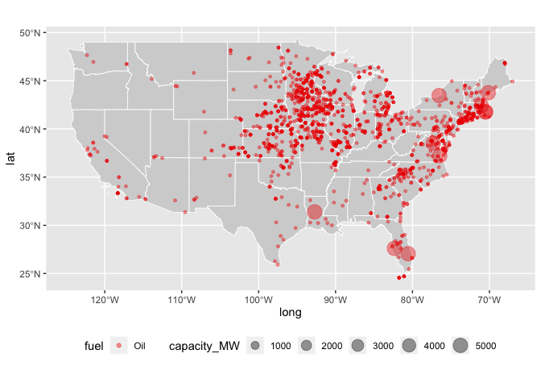
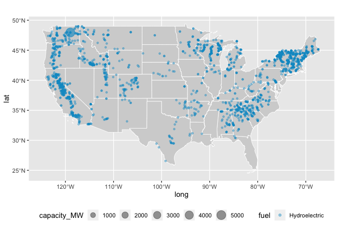
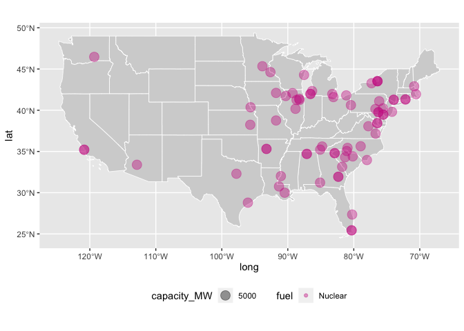
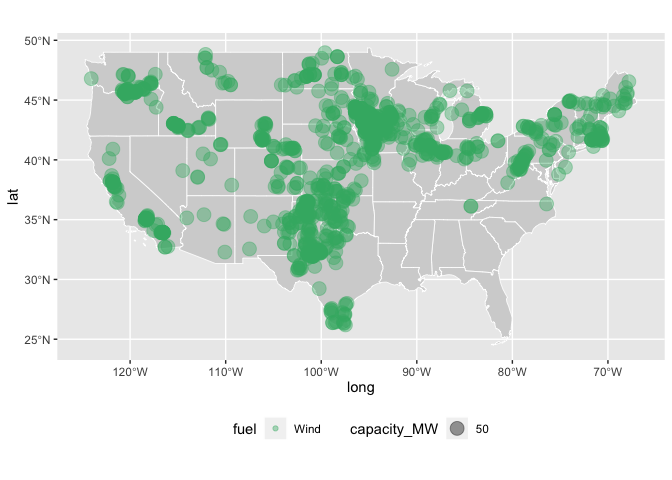
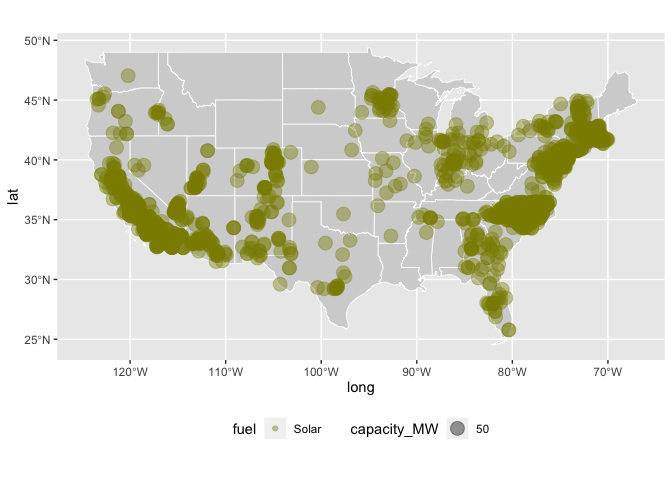
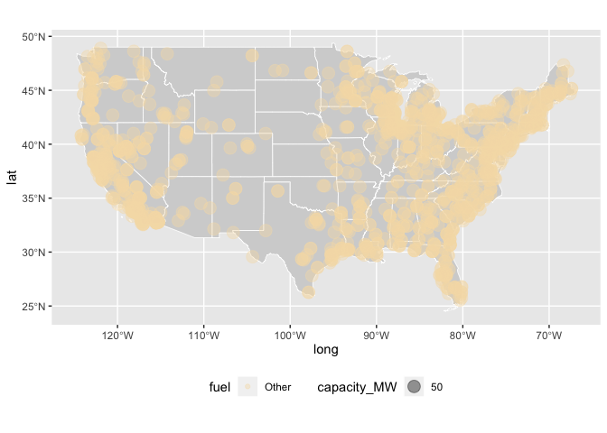

Progress report 1
================
Amy Kouch
2020-02-05

  - [Summary](#summary)
  - [Key Findings](#key-findings)
  - [Current Issues](#current-issues)
  - [Next Steps](#next-steps)

## Summary

  - Created three scripts: generators, plants, and generators\_plants
    that read in the dataset and clean them from the raw data files.
    generators\_plants combines the two datasets together
  - Cleaned the data to be able to use for visualization
  - Recreated the WSJ’s visualizations (but needs improvement\!)

## Key Findings

  - Better understanding how the US generates electricity
  - How to categorize different fuel types
  - Natural gas generates the most electricity in the US

<!-- end list -->

    ## Warning: Removed 1 rows containing missing values (geom_point).

<!-- --><!-- --><!-- --><!-- --><!-- --><!-- --><!-- --><!-- -->

    ## Warning: Removed 1 rows containing missing values (geom_point).

<!-- -->

## Current Issues

After meeting with Bill, we discussed doing an economic analysis of
transitioning into 100% renewable- what is the gap between where we are
now and where we need to go? We discussed finding a paper that has
already done this analysis, but one of my current challenges is finding
this paper.

Papers vary in terms of their reports for the cost of transitioning into
renewable energy. The papers have very large assumptions and differ by
billions of $.

Other issues: adding Hawaii/Alaska, fixing the size of points

## Next Steps

  - Check for accuracy of my numbers versus WSJ’s numbers
  - Create a function for visualizations
  - Make minor edits to better visualizations: size, color, remove
    background, Hawaii/Alaska
  - Find a paper with some sort of economic analysis or find a different
    analysis of the papers
  - Calculate percentage of electricity that is currently renewable in
    all 50 states
