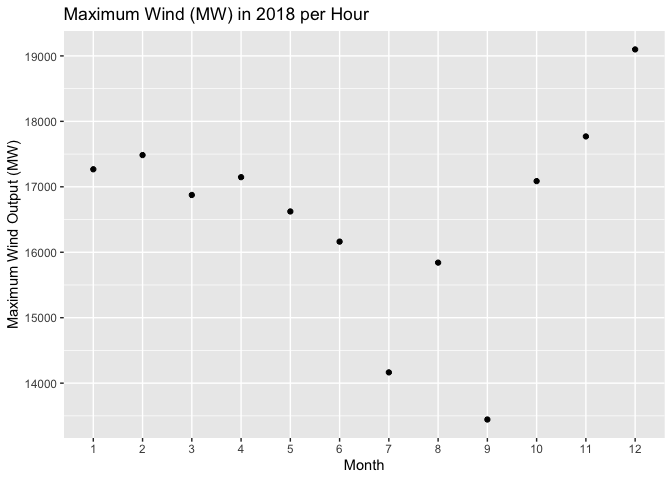

Progress report 2
================
Amy Kouch
2020-02-19

  - [Summary](#summary)
  - [Key Findings](#key-findings)
      - [Mapping how the United States generates its
        electricity](#mapping-how-the-united-states-generates-its-electricity)
      - [Plants by Fuel Type](#plants-by-fuel-type)
      - [Energy Mix in Texas](#energy-mix-in-texas)
      - [Wind in Texas](#wind-in-texas)
  - [Key Issues](#key-issues)
  - [Challenge for Team](#challenge-for-team)
  - [Next Steps](#next-steps)

## Summary

  - Cleaned up visualizations / recreations from Washington Post with
    Albers projection, change in color, scales
  - Created a function to plot individual visualizations
  - Created two scripts: texas\_load and texas\_wind that read in the
    dataset and clean them from the raw data files
  - Analyzed wind in Texas

## Key Findings

### Mapping how the United States generates its electricity

Recreating [The Washington Post’s
Visualizations](https://www.washingtonpost.com/graphics/national/power-plants/?noredirect=on&utm_term=.c26c761b9a3c)
regarding power plant generation in the United States.

<!-- -->

### Plants by Fuel Type

The visualizations below are also recreations of the Washington Post’s
maps of the US.

Regionally: \* Wind plants are along the middle of the United States \*
Solar and hydroelectric power are on the two coasts \* Natural gas
appears to be prevalent everywhere \* Coal, oil, and nuclear are more
common in the East than the West

<!-- --><!-- --><!-- --><!-- --><!-- --><!-- --><!-- -->

### Energy Mix in Texas

**Understanding Texas’ energy mix**

  - More than 60% of Texas’ capacity is in Natural gas
  - Renewable energy resources are less than 20% of the mix
  - Baseload sources: nuclear, coal
  - Peaker: natural gas

The Solutions Project has determined that the ideal renewable energy mix
includes 50% of [wind](https://thesolutionsproject.org/infographic/#tx)
by 2050.

<!-- -->

| fuel          | generation | percentage |
| :------------ | ---------: | ---------: |
| Coal          |    24862.4 |      0.174 |
| Hydroelectric |      708.6 |      0.005 |
| Natural Gas   |    89871.3 |      0.630 |
| Nuclear       |     5138.6 |      0.036 |
| Oil           |      122.5 |      0.001 |
| Other         |     1290.1 |      0.009 |
| Solar         |      584.8 |      0.004 |
| Wind          |    20187.8 |      0.141 |

<!-- -->

    ## Warning: Column `fuel` joining factor and character vector, coercing into
    ## character vector

<!-- -->

As seen from the visualization above, Texas will have to increase its
already- large wind capacity.

**“Texas produces more electricity than any other state, generating
almost twice as much as Florida, the second-highest
electricity-producing state.” (EIA)**

``` r
gen_plants %>%
  st_drop_geometry() %>%
  group_by(state) %>%
  summarise(energy_produced = sum(capacity)) %>%
  arrange(desc(energy_produced))
```

    ## # A tibble: 49 x 2
    ##    state energy_produced
    ##    <chr>           <dbl>
    ##  1 TX            142766.
    ##  2 CA             94754.
    ##  3 FL             81334.
    ##  4 NY             52951.
    ##  5 IL             50962.
    ##  6 PA             50214.
    ##  7 GA             43593.
    ##  8 NC             39215 
    ##  9 WA             38602.
    ## 10 AZ             36586.
    ## # … with 39 more rows

### Wind in Texas

According to the [EIA](https://www.eia.gov/state/?sid=TX#tabs-1), “Texas
leads the nation in wind-powered generation and produced one-fourth of
all the U.S. wind powered electricity in 2017. Texas wind turbines have
produced more electricity than both of the state’s nuclear power plants
since 2014.”

Using ERCOT data, we have determined that:

  - 18.53% of the load in Texas was covered by wind generation.
  - 32.77% of the wind capacity in the US is located in Texas

<!-- end list -->

    ## [1] 0.185346

    ## # A tibble: 2 x 2
    ##   texas `sum(capacity)`
    ##   <lgl>           <dbl>
    ## 1 FALSE          61594 
    ## 2 TRUE           20188.

The goal is to understand the potential of Texas wind and whether these
goals are realistic.

In Texas, [ERCOT](http://www.ercot.com/about) is a utility provider that
accounts for up to 90% of the electricity in Texas. We are using ERCOT
load and generation data for this analysis. The [Advanced Energy Economy
Institute](https://info.aee.net/hubfs/EPA/AEEI-Renewables-Grid-Integration-Case-Studies.pdf?t=1440089933677)
has a report that Renewable Energy integration with ERCOT would be
technically feasible.

<!-- --><!-- --><!-- -->

    ## geom_path: Each group consists of only one observation. Do you need to adjust
    ## the group aesthetic?

<!-- -->

    ## geom_path: Each group consists of only one observation. Do you need to adjust
    ## the group aesthetic?

<!-- -->

## Key Issues

  - Labeling the states
  - Slightly-off data. For example, 375 coal plants versus 400 coal
    plants.
  - Confirmation of results via article

## Challenge for Team

  - Understanding wind in Texas - during what time of day is wind best?
    Worst? Which month has the highest wind output?

## Next Steps

  - Try to find more sources of information to confirm the results of
    this analysis
  - Try to find discrepancies in why the results are not exact
  - Determine how many MW of wind Texas will need in order to meet
    expected renewable mix of 50% wind – “is this a reasonable
    expectation?”
