Final report
================
Amy Kouch
2020-03-13

  - [Electricity generation in the United
    States](#electricity-generation-in-the-united-states)
  - [Case Study: Wind in Texas](#case-study-wind-in-texas)
      - [Current Texas Wind](#current-texas-wind)
      - [Transitioning to 100% Renewable
        Energy](#transitioning-to-100-renewable-energy)

## Electricity generation in the United States

Recently, the United States’ electricity generation has been a changing
landscape, as renewables have become more economically viable and more
popular with an increased interest in climate change.

**Overview:** The premise of the following report is to better
understand the US electricity generation over the span of a 5-year
period (2014-2018) in the context of renewable energy. The report then
includes a case study of wind energy in Texas and considers the
feasibility of reaching 100% renewable energy.

**Data:** The data used in this analysis comes the United States Energy
Information Administration’s [Form
EIA-860](https://www.eia.gov/electricity/data/eia860/) and their
[Balancing Authority’s Hourly Electric Grid
Monitor](https://www.eia.gov/beta/electricity/gridmonitor/dashboard/electric_overview/balancing_authority/ERCO).
The EIA-860 form contains granular data regarding exisiting and planned
generators and power plants with 1 megawatt or greater of combined
nameplate capacity. The Hourly Grid Monitor data I used is for Electric
Reliability Council of Texas, Inc. (ERCO). To better understand Texas
demand load and wind generation, I used [Hourly Aggregated Wind
Output](http://www.ercot.com/gridinfo/generation) data and the [ERCOT
Hourly Load Data](http://www.ercot.com/gridinfo/load/load_hist) from the
ERCO website.

**Goal:** To capture the United States’ current electricity mix and to
visualize the challenges and commitments necessary for a renewable
future for the state of Texas.

``` r
knitr::include_graphics("fuel_map.gif")
```


Originally by the Washington Post’s [“Mapping how the United States
generates its
electricity”](https://www.washingtonpost.com/graphics/national/power-plants/?noredirect=on&utm_term=.c26c761b9a3c),
the recreation below visualizes US electricity generation by fuel type
in 2018 using data from the [US Energy Information
Administration](https://www.eia.gov/electricity/data/eia860/).

``` r
gen_plants <-
  file_generators_plants %>%
  read_rds() %>%
  mutate(
    fuel = 
      case_when(
        technology %in% natural_gas ~ "Natural Gas",
        technology %in% coal ~ "Coal",
        technology %in% nuclear ~ "Nuclear",
        technology %in% hydroelectric ~ "Hydroelectric",
        technology %in% oil ~ "Oil",
        technology %in% wind ~ "Wind",
        technology %in% solar ~ "Solar",
        technology %in% other ~ "Other",
      )
  ) %>%
  group_by(year, plant_code, fuel) %>%
  mutate(
    capacity = sum(capacity)
  ) %>%
  distinct() %>%
  drop_na(long, lat) %>%
  st_as_sf(coords = c("long", "lat"), crs = 4326) %>%
  st_transform(crs = US_ALBERS) %>%
  ungroup()
```

``` r
gen_plants %>%
  filter(
    year == 2018,
    fuel %in% fuel_types
  ) %>% 
  arrange(desc(capacity)) %>%
  ggplot() +
  geom_sf(
    data = states, 
    fill = "lightgray", 
    color = "white", 
    size = 0.3
  ) + 
  geom_sf(
    aes(color = fuel, size = capacity),
    alpha = 0.4,
    show.legend = "point"
  ) + 
  geom_sf_text(
    aes(label = STUSPS),
    size = 3,
    color = "white",
    fontface = "bold",
    data = states
  ) +
  geom_sf_text(
    aes(label = STUSPS),
    size = 2.8,
    color = "black",
    data = states
  ) +
  scale_color_manual(
    values = 
      c(
        "Natural Gas" = "#f78b29", 
        "Coal" = "#585b56", 
        "Nuclear" = "#cf4a9b", 
        "Hydroelectric" = "#0081c5", 
        "Oil" = "#ee1b24", 
        "Wind" = "#0fb14c", 
        "Solar" = "#d7c944"
      )
  ) +
  scale_size(
    range = c(0.1, 6), 
    breaks = c(50, 500, 2000, 5000)
  ) + 
  theme_void() + 
  theme(
    legend.position = "bottom",
    legend.box = "vertical"
  ) +
  labs(
    title = "United States Electricity Generation (2018)",
    caption = "Source: US Energy Information Administration"
  )
```

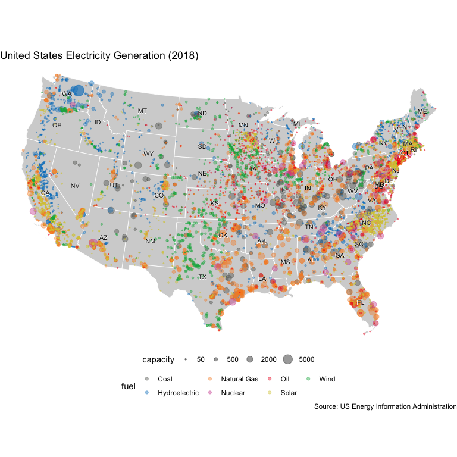

Demonstrated in the figure above, the US has a diverse fuel mix of both
fossil-fuels and renewable energy.

``` r
plot_by_fuel <- function(fuel_type) {
  gen_plants %>%
    filter(
      year == 2018,
      fuel == fuel_type
    ) %>% 
    arrange(desc(capacity)) %>%
    ggplot() +
    geom_sf(
      data = states, 
      fill = "lightgray", 
      color = "white", 
      size = 0.3
    ) + 
    geom_sf(
      aes(color = fuel, size = capacity),
      alpha = 0.4,
      show.legend = "point"
    ) + 
    geom_sf_text(
      aes(label = STUSPS),
      size = 2.25,
      color = "white",
      fontface = "bold",
      data = states
    ) +
    geom_sf_text(
      aes(label = STUSPS),
      size = 2,
      color = "black",
      data = states
    ) +
    scale_color_manual(
      values = 
        c(
          "Natural Gas" = "#f78b29", 
          "Coal" = "#585b56", 
          "Nuclear" = "#cf4a9b", 
          "Hydroelectric" = "#0081c5", 
          "Oil" = "#ee1b24", 
          "Wind" = "#0fb14c", 
          "Solar" = "#d7c944"
        )
    ) +
    scale_size(
      range = c(0.1, 6), 
      breaks = c(50, 500, 2000, 5000)
    ) + 
    theme_void() + 
    theme(
      legend.position = "bottom",
      legend.box = "vertical"
    ) +
    labs(
      caption = "Source: US Energy Information Administration",
      title = str_glue({fuel_type}, " Power in the United States"),
      size = "capacity (MW)"
    )
}
```

``` r
plot_by_fuel("Natural Gas")
```

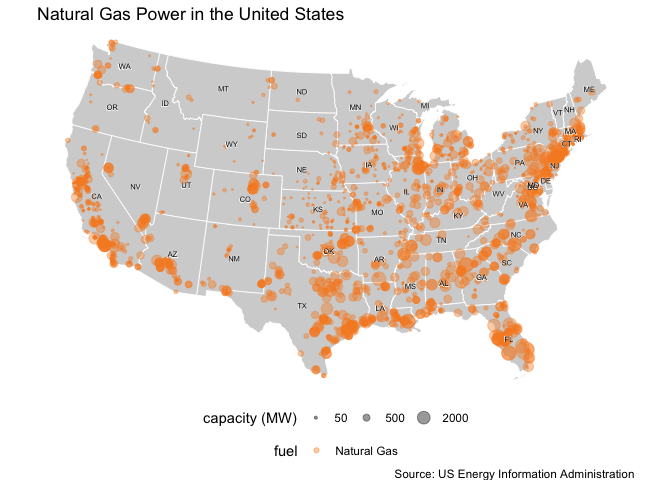

In 2018, there were **2030** natural gas powered electricity plants in
the United States. They generated **49%** of the United States
electricity during that year.

The states that have used the most natural gas in MW are in the table
below:

``` r
ng_type_state %>%
  knitr::kable()
```

| state | capacity |
| :---- | -------: |
| TX    |  92129.6 |
| FL    |  56220.7 |
| CA    |  50426.7 |
| NY    |  33673.4 |
| PA    |  25408.3 |

``` r
plot_by_fuel("Coal")
```

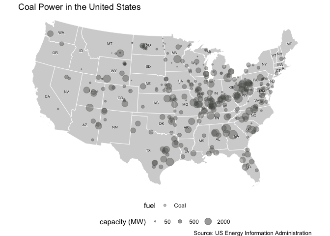

In 2018, there were **330** coal powered electricity plants in the
United States. They generated **20%** of the United States electricity
during that year.

The states that have used the most coal in MW are in the table below:

``` r
coal_type_state %>%
  knitr::kable()
```

| state | capacity |
| :---- | -------: |
| TX    |  20443.5 |
| IN    |  16976.4 |
| KY    |  14193.7 |
| IL    |  13985.1 |
| OH    |  13120.2 |

``` r
plot_by_fuel("Oil")
```

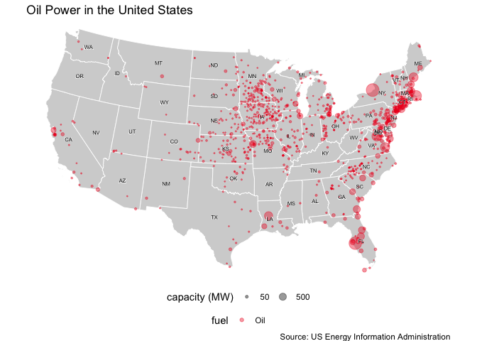

In 2018, there were **970** oil powered electricity plants in the United
States. They generated **3%** of the United States electricity during
that year.

The states that have used the most oil in MW are in the table below:

``` r
oil_type_state %>%
  knitr::kable()
```

| state | capacity |
| :---- | -------: |
| FL    |   3921.4 |
| NY    |   3879.2 |
| MA    |   2867.3 |
| VA    |   2751.2 |
| CT    |   2348.5 |

``` r
plot_by_fuel("Nuclear")
```

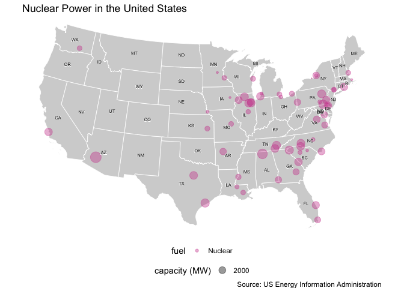

In 2018, there were **60** nuclear powered electricity plants in the
United States. They generated **8%** of the United States electricity
during that year.

The states that have produced the most nuclear in MW are in the table
below:

``` r
nuc_type_state %>%
  knitr::kable()
```

| state | capacity |
| :---- | -------: |
| IL    |  12415.1 |
| PA    |  10513.0 |
| SC    |   6875.1 |
| NY    |   5709.4 |
| NC    |   5394.7 |

``` r
plot_by_fuel("Solar")
```

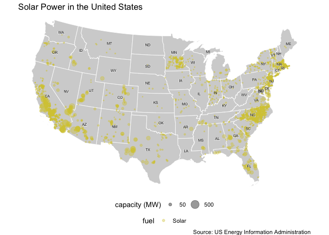

In 2018, there were **2741** solar powered electricity plants in the
United States. They generated **2%** of the United States electricity
during that year.

The states that have produced the most solar in MW are in the table
below:

``` r
sol_type_state %>%
  knitr::kable()
```

| state | capacity |
| :---- | -------: |
| CA    |  10543.7 |
| NC    |   4007.9 |
| TX    |   1943.1 |
| AZ    |   1787.3 |
| NV    |   1725.3 |

``` r
plot_by_fuel("Wind")
```

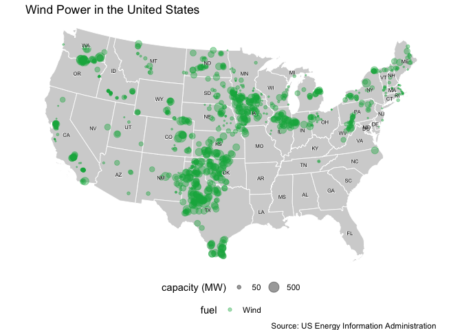

In 2018, there were **1099** wind powered electricity plants in the
United States. They generated **7%** of the United States electricity
during that year.

The states that have produced the most wind in MW are in the table
below:

``` r
wind_type_state %>%
  knitr::kable()
```

| state | capacity |
| :---- | -------: |
| TX    |  24187.3 |
| IA    |   8386.7 |
| OK    |   8070.7 |
| CA    |   6077.8 |
| KS    |   5375.8 |

``` r
plot_by_fuel("Hydroelectric")
```

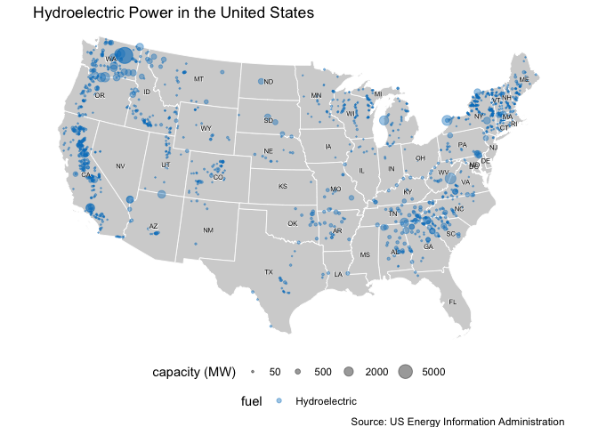

In 2018, there were **1458** hydro-powered electricity plants in the
United States. They generated **9%** of the United States electricity
during that year.

The states that have produced the most hydropower in MW are in the table
below:

``` r
hydr_type_state %>%
  knitr::kable()
```

| state | capacity |
| :---- | -------: |
| WA    |  28395.5 |
| CA    |  16255.2 |
| OR    |   8452.2 |
| NY    |   5931.6 |
| GA    |   5047.0 |

**Key Findings**

  - The majority of wind turbines reside in the central area of the
    United States, which according to
    [WINDExchange](https://windexchange.energy.gov/maps-data/321) has
    the potential wind capacity, due to wind speed and direction during
    this time.
  - Solar and hydroelectric power are found along the two coasts, which
    makes sense as ocean and sun are flow resources abundant in these
    areas.
  - Natural gas appears to be prevalent throughout the United States and
    has been called [a transition
    fuel](https://www.iea.org/reports/the-role-of-gas-in-todays-energy-transitions)
    that acts as an alternative to polluting fossil fuels. However,
    there is
    [controversy](https://www.greenamerica.org/fight-dirty-energy/amazon-build-cleaner-cloud/natural-gas-transition-fuel-myth)
    regarding the beneficial environmental impacts of natural gas.
  - Coal, oil, and nuclear are mostly located in the Midwest and along
    the East Coast. The Pacific Northwest has aggressive renewable
    energy portfolio standards that force states like California to
    remove and retire their emissions-heavy fossil fuel resources.

Despite the dominant fossil fuels in the US electricity mix, renewable
sources such as wind and solar have been steadily growing during recent
years. Although hydroelectric power is a renewable resource, the best
sites for hydroelectric dams have already been built and taken advantage
of. Therefore, most renewable efforts focus on solar and wind.

*The figure below demonstrates the growth in renewable energy from 2014
to 2018. Note wind capacity increase in Texas.*

``` r
anim_fuel_time <-
  gen_plants %>%
  group_by(year, fuel) %>%
  summarise(total_capacity = sum(capacity)) %>%
  mutate(prop = total_capacity / sum(total_capacity)) %>%
  ggplot(aes(year, prop, color = fuel)) +
  geom_line(size = 1) +
  geom_point() +
  geom_text(aes(x = year, label = fuel), hjust = -0.2) + 
  coord_cartesian(clip = 'off') + 
  scale_color_manual(
    values = 
      c(
        "Natural Gas" = "#f78b29", 
        "Coal" = "#585b56", 
        "Nuclear" = "#cf4a9b", 
        "Hydroelectric" = "#0081c5", 
        "Oil" = "#ee1b24", 
        "Wind" = "#0fb14c", 
        "Solar" = "#d7c944", 
        "Other" = "#585b56"
      ),
    guide = "none"
  ) +
  scale_y_continuous(labels = scales::label_percent()) +
  transition_reveal(year) +
  labs(
    title = "U.S. Electricity Generation by Fuel Type (2014-2018)",
    caption = "Source: US Energy Information Administration",
    x = "Year",
    y = "Proportion of US Electricity Mix (%)"
  )

animate(
  anim_fuel_time, 
  duration = 5, 
  fps = 15, 
  width = 500, 
  height = 500, 
  renderer = gifski_renderer()
)

anim_save("fuel_time.gif")
```

``` r
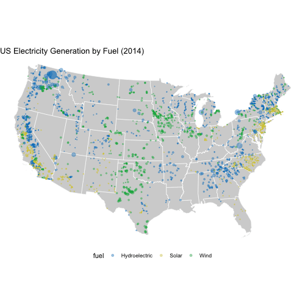
```


``` r
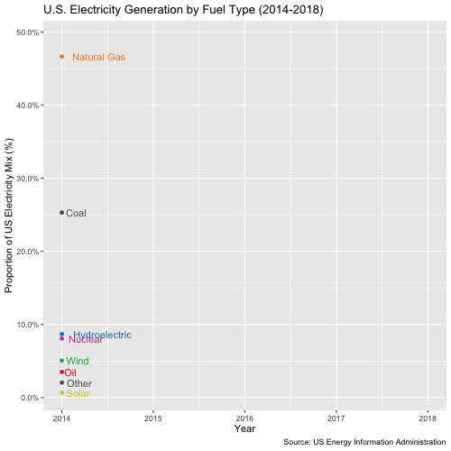
```


``` r
us_mix <-
  gen_plants %>%
  filter(year == 2018) %>%
  group_by(fuel) %>%
  summarise(total_capacity_us = sum(capacity)) %>%
  mutate(
    prop_us = total_capacity_us / sum(total_capacity_us),
    fuel = fct_reorder(fuel, prop_us)
  ) %>%
  st_set_geometry(NULL)
  
us_mix %>%
  ggplot(aes(prop_us, fuel, color = fuel)) +
  geom_point(size = 3) +
  scale_color_manual(
    values = 
      c(
        "Natural Gas" = "#f78b29", 
        "Coal" = "#585b56", 
        "Nuclear" = "#cf4a9b", 
        "Hydroelectric" = "#0081c5", 
        "Oil" = "#ee1b24", 
        "Wind" = "#0fb14c", 
        "Solar" = "#d7c944", 
        "Other" = "#ffefd6"
      ),
    guide = "none"
  ) +
  scale_x_continuous(labels = scales::label_percent()) +
  theme_minimal() +
  labs(
    title = "U.S. Electricity Generation by Fuel Type (2018)",
    caption = "Source: US Energy Information Administration",
    x = "Proportion of US Electricity Mix (%)",
    y = "Fuel Type"
  )
```

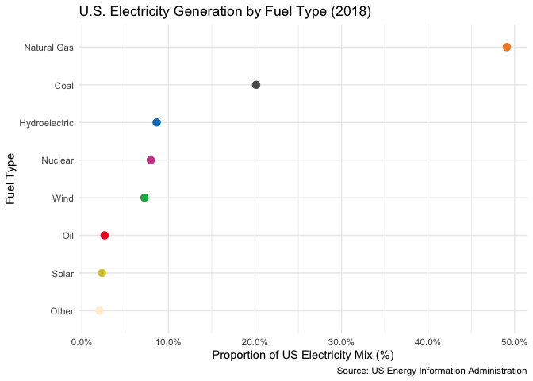

**Key Findings**

  - From 2014 to 2018, natural gas has increased from a little more than
    45% to nearly 50% of the United States electricity mix. [Hydraulic
    fracking](https://www.eia.gov/todayinenergy/detail.php?id=26112) has
    allowed for natural gas to be a cheap and abundant energy resource.
  - As a result of [natural gas plants
    increasing](https://www.nytimes.com/2019/06/26/climate/natural-gas-renewables-fight.html),
    coal has been steadily decreasing its proportion of the US
    generation. Coal plants that were built in the 1970s have been
    decommissioned.
  - Although it appears to be only a small percentage of the US
    electricity mix, do not lose hope\! Wind and solar have both
    increased during the 5-year time period. Solar is close to
    surpassing oil, and wind is close to surpassing nuclear power and
    hydropower.

<!-- end list -->

``` r
gen_plants %>%
  count(fuel, year) %>%
  group_by(fuel) %>%
  summarise(
    percent_difference = (last(n) - first(n)) / first(n)
  ) %>%
  mutate(
    fuel = fct_reorder(fuel, percent_difference)
  ) %>%
  ggplot(aes(fct_rev(fuel), percent_difference, fill = fuel)) +
  geom_hline(
    yintercept = 0,
    color = "gray70", 
    size = 1
  ) +
  geom_col(position = "dodge") +
  scale_fill_manual(
    values = 
      c(
        "Natural Gas" = "#f78b29", 
        "Coal" = "#585b56", 
        "Nuclear" = "#cf4a9b", 
        "Hydroelectric" = "#0081c5", 
        "Oil" = "#ee1b24", 
        "Wind" = "#0fb14c", 
        "Solar" = "#d7c944", 
        "Other" = "#ffefd6"
      ),
    guide = "none"
  ) +
  scale_y_continuous(labels = scales::label_percent()) + 
  theme_minimal() +
  labs(
    title = "U.S. Electricity Generation by Fuel Type (2014 - 2018)",
    caption = "Source: US Energy Information Administration",
    y = "Change in Capacity from 2014 to 2018",
    x = "Fuel Type"
  )
```

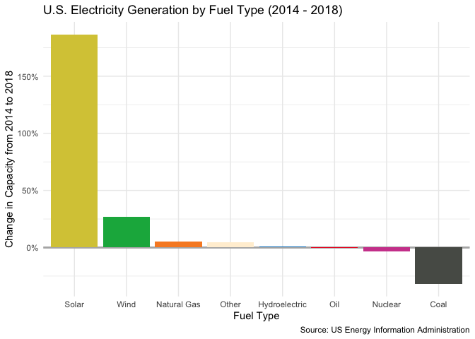

**Key Findings**

  - Although the change in solar appears to be minor in the context of
    the entire energy mix, when considering the installed-capacity of
    solar alone, it has more than doubled in its installed capacity in
    the last 5 years.
  - Wind has also been growing approximately 125% of its installed
    capacity over the last 5 years.
  - Natural gas, hydropower, oil, and nuclear have made very minor
    changes over the last 5 years. To understand overall trends, these
    plants will need to be studied on a long-term basis, in order to see
    the frequency of decommissioning.
  - Coal has decreased by approximately 30% from 2014 to 2018,
    demonstrating that although coal plants are retiring, it does not
    seem like they are being rebuilt.

## Case Study: Wind in Texas

In this portion of the report, we study wind energy in Texas. However,
first, we must look at the current energy make-up of Texas.

``` r
file_generators_plants %>%
  read_rds() %>%
  mutate(
    fuel = 
      case_when(
        technology %in% natural_gas ~ "Natural Gas",
        technology %in% coal ~ "Coal",
        technology %in% nuclear ~ "Nuclear",
        technology %in% hydroelectric ~ "Hydroelectric",
        technology %in% oil ~ "Oil",
        technology %in% wind ~ "Wind",
        technology %in% solar ~ "Solar",
        technology %in% other ~ "Other",
      )
  ) %>%
  group_by(year, plant_code, fuel) %>%
  mutate(capacity = sum(capacity)) %>%
  distinct() %>%
  drop_na(long, lat) %>%
  st_as_sf(coords = c("long", "lat"), crs = 4326) %>% 
  filter(
    state == "TX",
    year == 2018
  ) %>%
  ggplot() +
  geom_sf(
    data = texas, 
    fill = "lightgray", 
    color = "white", 
    size = 0.3
  ) + 
  geom_sf(
    data = texas_counties, 
    fill = "lightgray", 
    color = "gray75", 
    size = 0.3
  ) +
  geom_sf(
    aes(color = fuel, size = capacity),
    alpha = 0.5,
    show.legend = "point"
  ) + 
  scale_color_manual(
    values = 
      c(
        "Natural Gas" = "#f78b29", 
        "Coal" = "#585b56", 
        "Nuclear" = "#cf4a9b", 
        "Hydroelectric" = "#0081c5", 
        "Oil" = "#ee1b24", 
        "Wind" = "#0fb14c", 
        "Solar" = "#d7c944", 
        "Other" = "#ffefd6"
      )
  ) +
  scale_size(
    range = c(0.25, 6), 
    breaks = c(50, 500, 2000, 5000)
  ) + 
  theme_void() +
  labs(
    title = "Electricity Generation in Texas (2018)",
    caption = "Source: US Energy Information Administration"
  )
```


The figure above visualizes power plants in Texas by capacity and fuel
type.

``` r
gen_plants %>%
  filter(
    year == 2018, 
    state == "TX"
  ) %>%
  group_by(fuel) %>%
  summarise(total_capacity = sum(capacity)) %>%
  mutate(
    prop = total_capacity / sum(total_capacity)
  ) %>%
  st_set_geometry(NULL) %>%
  left_join(us_mix, by = "fuel") %>%
  mutate(
    fuel = fct_reorder(fuel, prop)
  ) %>%
  ggplot(aes(y = fuel)) +
  geom_point(aes(x = prop_us), size = 3, color = "grey", alpha = 0.8) +
  geom_point(aes(x = prop, color = fuel), size = 3) +
  scale_color_manual(
    values = 
      c(
        "Natural Gas" = "#f78b29", 
        "Coal" = "#585b56", 
        "Nuclear" = "#cf4a9b", 
        "Hydroelectric" = "#0081c5", 
        "Oil" = "#ee1b24", 
        "Wind" = "#0fb14c", 
        "Solar" = "#d7c944", 
        "Other" = "#ffefd6"
      ),
    guide = "none"
  ) +
  scale_x_continuous(labels = scales::label_percent()) + 
  theme_minimal() +
  labs(
    title = "Texas Electricity Generation by Fuel Type (2018)",
    subtitle = "comparison to US Electricity Generation (gray)",
    caption = "Source: US Energy Information Administration",
    x = "Proportion of Texas' Electricity Mix (%)",
    y = "Fuel Type"
  )
```


**Key Findings**

  - Compared to the United States electricity’s mix, Texas has a higher
    proportion of natural gas and wind. Both are dominant industries in
    Texas, and we are focusing this report on wind.
  - In every other fuel type, Texas is below the national proportion,
    especially for coal (a good thing\!), nuclear (also good, depending
    on who you’re talking to), and hydroelectric power (understandable
    given the site-specific constraints of this resource)

<!-- end list -->

``` r
texas_load_wind %>%
  count(date, wt = demand) %>%
  ggplot(aes(date, n)) +
  geom_line() +
  scale_y_continuous(
    labels = scales::label_number(scale = 0.000001,  suffix = "M")
  ) +
  theme_minimal() +
  labs(
    title = "Demand Load - ERCOT 8760 hour profile (2019)",
    x = "Date",
    y = "Demand (MW)",
    caption = "Source: Electric Reliability Council of Texas (ERCOT)"
  )
```

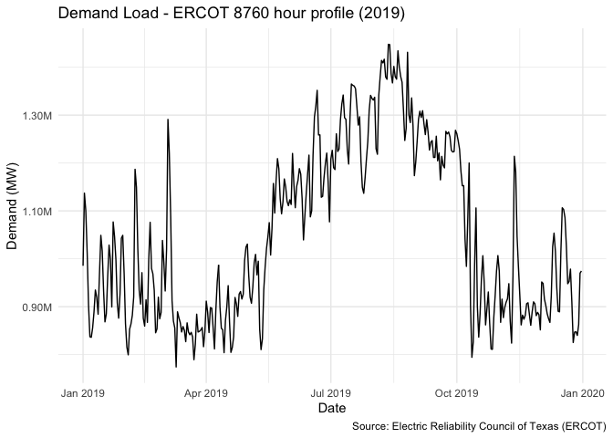

**Key Finding**

  - Electricity demand fluctuates throughout the year, by time of day
    and by season. The demand is highest during the summer months, and
    lowest during the spring. For sunny states like California and
    Texas, this is typical, as summer months increase usage of AC which
    increase electricity demand and winter months require heating.

### Current Texas Wind

Recently, Texas has been receiving attention for its [wind
energy](https://www.cnn.com/2019/07/25/us/texas-wind-energy-trnd/index.html).
In fact, according to [Wind Energy
International](https://www.usatoday.com/story/news/2019/10/18/texas-wind-energy-so-strong-its-beating-out-coal-power/3865995002/),
if Texas was its own country, it would be the fifth-largest wind energy
producer in the world\!

*What does wind look like as a resource?*

``` r
gen_plants_texas_wind <-
  gen_plants %>%
  st_drop_geometry() %>%
  filter(
    fuel %in% "Wind",
    year == "2018"
  ) %>%
  mutate(texas = if_else(state == "TX", TRUE, FALSE)) %>%
  group_by(texas) %>%
  summarise(capacity = sum(capacity)) %>%
  ungroup() %>%
  summarise(percent_tx = last(capacity) / first(capacity))

gen_plants_texas_wind %>%
  pull(percent_tx)
```

    ## [1] 0.3429996

Currently, **34%** of the United States’ wind energy generation occurs
in Texas.

``` r
texas_load_wind %>%
  count(date, wt = wind) %>%
  ggplot(aes(date, n)) +
  geom_line() +
  scale_y_continuous(
    labels = scales::label_number(scale = 0.000001,  suffix = "M")
  ) +
  theme_minimal() +
  labs(
    title = "Wind generation - ERCOT 8760 hour profile (2019)",
    x = "Date",
    y = "Wind Generation (MW)",
    caption = "Source: Electric Reliability Council of Texas (ERCOT)"
  )
```

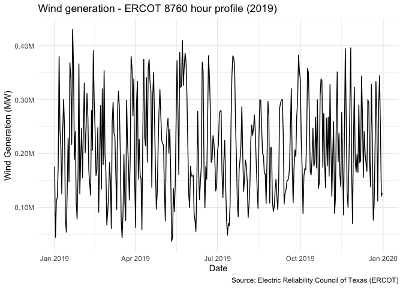

**Key Finding**

  - Luckily, wind in Texas is present during the entire year, which is
    why it’s such an attractive resource, as utilities can depend on
    generation during all seasons. Other resources such as solar will
    have less production during the Winter months compared to the Summer
    months.

Shown in figure *Demand Load - ERCOT 8760 hour profile (2019)*, we can
see that the peak demand load is around August. Below, we analyze what a
single day in August looks like.

``` r
texas_load_wind %>%
  filter(date == as.Date("2019-08-31")) %>%
  mutate(hour = hour(local_time)) %>%
  count(hour, wt = demand) %>%
  ggplot(aes(hour, n)) +
  geom_line() +
  scale_y_continuous(
    labels = scales::label_number(scale = 0.001,  suffix = "K")
  ) +
  theme_minimal() +
  labs(
    title = "Demand Load - ERCOT Hourly demand profile (2019-08-31)",
    x = "Hour",
    y = "Demand Load (MW)",
    caption = "Source: Electric Reliability Council of Texas (ERCOT)"
  )
```

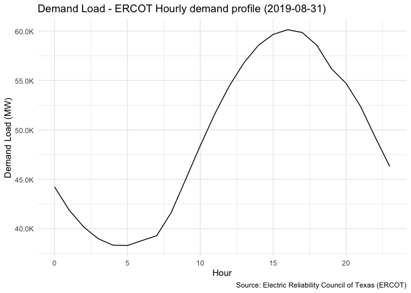

``` r
texas_load_wind %>%
  filter(date == as.Date("2019-08-31")) %>%
  mutate(hour = hour(local_time)) %>%
  count(hour, wt = wind) %>%
  ggplot(aes(hour, n)) +
  geom_line() +
  scale_y_continuous(
    labels = scales::label_number(scale = 0.001,  suffix = "K")
  ) +
  theme_minimal() +
  labs(
    title = "Wind Generation - ERCOT Hourly generation profile (2019-08-31)",
    x = "Hour",
    y = "Wind Generation (MW)",
    caption = "Source: Electric Reliability Council of Texas (ERCOT)"
  )
```

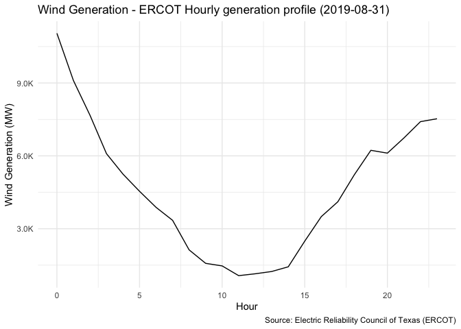

**Key Findings**

  - As expected, demand from midnight to 7am appear to be quite low,
    while the highest demand peaks in the evening, as people are coming
    home from work.
  - However, as demonstrated above, the wind generation is highest at
    night (when demand is lowest) but lowest during the day (when demand
    is highest). This structure makes wind complementary to solar but
    presents a challenge of meeting energy demand during the peaking
    times.

*… Even with such a huge wind presence, we would need to further
increase wind capacity in order to meet sustainable goals.*

With the urgency of climate change, some individuals are advocating for
utilties [to go 100%
renewable](https://www.vox.com/energy-and-environment/2018/9/14/17853884/utilities-renewable-energy-100-percent-public-opinion).
Being 100% renewable means providing energy from renewable resources
like the sun, wind, hydroelectric power, instead of fossil fuels. One
challenge with renewables is that their power is their variability.
Utilities need to plan for these changes in generation throughout the
day and the year. Even for states who are leaders in the renewable
energy front, 100% renewable energy is a daunting task. So how can we
achieve this?

Through our analysis, we will determine what going 100% renewable means
to [Electric Reliability Council of Texas
(ERCOT)](http://www.ercot.com/about) for the state of Texas,
specifically in the context of wind.

Often times, utilities will be working with 8760-hour data, which means
a years worth of data broken down by the hour. These hourly data are
typically for demand (how much electricity we are using\!) and
generation (how much electricity is being supplied by generation from
power plants). Utilities need to decide, hour by hour, which fuel
generation sources will be supplying the power needed to satisfy the
power demand.

### Transitioning to 100% Renewable Energy

[The Solutions Project](https://thesolutionsproject.org/) is an
organization that creates roadmaps to lead countries, cities, and states
to 100% renewable energy. Through analysis, they have determined that
the ideal renewable energy mix for Texas includes 63.9% of
[wind](https://thesolutionsproject.org/infographic/#tx) by 2050.

``` r
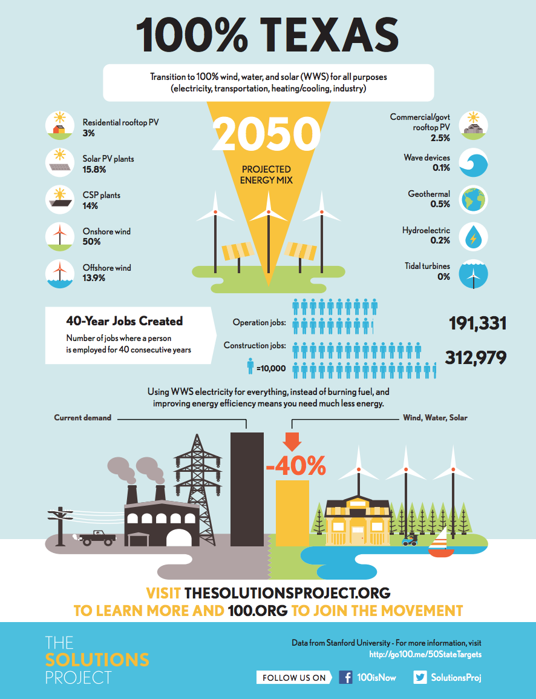
```


``` r
solutions <- 
  c(
    natural_gas = 0, 
    coal = 0, 
    wind = 0.639, 
    nuclear = 0,
    hydro = 0.03,
    solar = 0.326, 
    oil = 0,
    other = 0.005, 
    unknown = 0
  )

texas_current_mix <-
  texas_load_wind %>%
  mutate(
    year = year(date)
  ) %>%
  filter(year == year_texas) %>%
  pivot_longer(
    cols = c(
      coal, 
      natural_gas, 
      nuclear, 
      oil, 
      hydro, 
      solar, 
      wind, 
      other, 
      unknown
    ),
    names_to = "fuel",
    values_to = "mwh"
  ) %>%
  group_by(fuel) %>%
  summarise(
    generation = sum(mwh, na.rm = TRUE),
    percentage = sum(mwh, na.rm = TRUE) / sum(net_generation, na.rm = TRUE)
  ) %>%
  ungroup() %>%
  arrange(desc(percentage))

texas_current_mix %>%
knitr::kable()
```

| fuel         | generation | percentage |
| :----------- | ---------: | ---------: |
| natural\_gas |  181011510 |  0.4725107 |
| coal         |   78206102 |  0.2041485 |
| wind         |   76744419 |  0.2003329 |
| nuclear      |   41490569 |  0.1083066 |
| solar        |    4007054 |  0.0104600 |
| hydro        |     849300 |  0.0022170 |
| other        |     775250 |  0.0020237 |
| oil          |          0 |  0.0000000 |
| unknown      |          0 |  0.0000000 |

``` r
texas_current_wind <-
  texas_current_mix %>%
  filter(fuel == "wind") %>%
  pull(percentage)
```

Above is the Solutions Projects’ projected energy mix for Texas in a
100% renewable scenario.

``` r
texas_wind_projected <-
  texas_load_wind %>%
  mutate(
    mwh_renewable_wind = (solutions[["wind"]] / texas_current_wind) * wind
  ) %>% 
  select(
    date, 
    demand,
    wind,
    wind_capacity_MW,
    wind_output_percent_load,
    wind_output_percent_installed,
    mwh_renewable_wind
  )

texas_wind_projected %>% 
  pivot_longer(
    cols = c(wind, mwh_renewable_wind),
    names_to = "scenario",
    values_to = "mwh"
  ) %>%
  group_by(date, scenario) %>%
  summarise(mwh = sum(mwh)) %>%
  ungroup() %>%
  ggplot(aes(date, mwh)) +
  geom_area(aes(fill = scenario)) +
  scale_fill_manual(
    values = c("#0fb14c", "gray75"), 
    name = "Case",
    labels = c("Current 2019 Data", "100% Renewable Energy Scenario")
  ) +
  scale_y_continuous(
    labels = scales::label_number(scale = 0.000001,  suffix = "M")
  ) +
  theme_minimal() +
  theme(legend.position = "bottom") +
  labs(
    title = "Projected Wind Generation in Texas - 100% Renewable Scenario",
    caption = "Source: Electricity Reliability Council of Texas",
    x = "Date",
    y = "Time"
  )
```

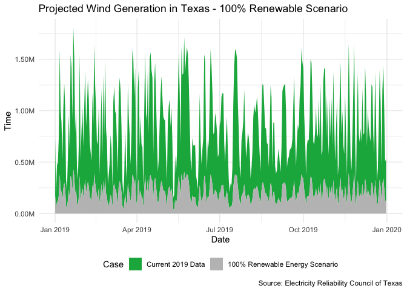

**Key Findings**

  - As demonstrated from the plot above, wind generation will need to
    dramatically increase in order to rise from about 20% of the current
    2019 energy mix to above 60% of the energy mix. As mentioned before,
    Texas is *already* a leader in wind energy in the United States.
  - The graph above assumes that the wind capacity at a given time is
    fixed, but in an ideal scenario, wind efficiency can be optimized.

<!-- end list -->

``` r
old_capacity <- 
  texas_wind_projected %>%
  summarise(capacity = max(wind_capacity_MW)) %>%
  pull()

new_capacity <-
  texas_wind_projected %>%
  mutate(
    wind_output_percent = wind_output_percent_installed / 100,
    new_capacity = mwh_renewable_wind / wind_output_percent
  ) %>%
  summarise(capacity = max(new_capacity)) %>%
  pull()
```

ERCOT currently has **27.06GW** of wind energy, and ERCOT would need to
install **139.48GW** in order to have 100% renewable energy, as
recommended by The Solutions Project. The reason that this value is so
high is that, as seen in previous graphs, the time of highest demand
appears to have low wind generation. Realistically, a 63% wind
electricity mix does not mean wind needs to provide 63% of the demand at
every hour- it simply needs to provide 63% overall. Balancing
Authorities have the capacity to optimize for which fuel source should
be used, and therefore, it is likely that the actual needed installed
capacity is much lower to reach 100% renewable energy.

While this report does not present an economic analysis to account for
feasibility of installation, it’s important to note that this final
value is an actual numeric value to account for all demand throughout
the year in Texas. Research for this project showed a gap in roadmap
planning for renewable energy: that current planning documents only
included vague numbers for percentage breakdown of renewable energy but
did not include a concrete number of how much renewable energy needs to
be installed in order to attain this goal.

In order to reach 100% renewable energy, we must create clear roadmaps
and actionable goals to reach.
